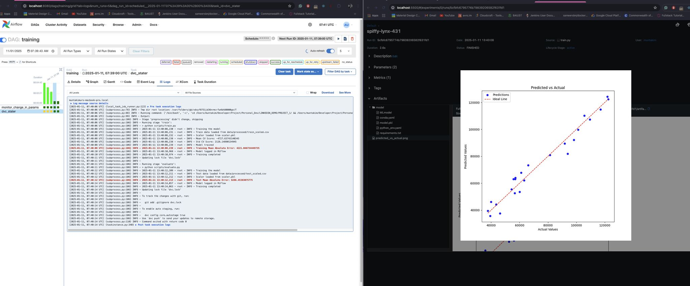

# Years of Experience vs. Salary Prediction: Linear Regression Model Pipeline

This repository demonstrates a robust machine learning pipeline for predicting salaries based on years of experience using a **linear regression model**. The pipeline integrates tools like **DVC** for data and model versioning, **Airflow** for parameter scanning, and **MLflow** for tracking model performance.



---

## Table of Contents

- [Overview](#overview)
- [Project Structure](#project-structure)
- [Features](#features)
- [Tools and Technologies](#tools-and-technologies)
- [Setup and Installation](#setup-and-installation)
- [Usage](#usage)
  - [Pipeline Execution](#pipeline-execution)
  - [Parameter Scanning with Airflow](#parameter-scanning-with-airflow)
  - [Tracking with MLflow](#tracking-with-mlflow)
- [Contributing](#contributing)
- [License](#license)

---

## Overview

The project focuses on:

1. **Preprocessing**: Cleaning and transforming the dataset for linear regression.
2. **Training**: Developing a linear regression model to predict salaries.
3. **Evaluation**: Assessing model performance with metrics like MAE, MSE, and R².
4. **Versioning and Tracking**: Using DVC to manage data/model versions and MLflow to log and track experiment performance.
5. **Parameter Scanning**: Automating hyperparameter exploration with Airflow DAGs.

---

## Project Structure

```plaintext
.
├── data/               # Raw and processed datasets
├── scripts/            # Source code for preprocessing, training, and evaluation
├── models/             # Saved models
|-- metrics/            # Saved metrics
├── dvc.yaml            # DVC pipeline configuration
├── params.yaml         # Model and processing configuration
├── dags/               # Airflow DAGs for parameter scanning
├── mlflow_logs/        # MLflow tracking logs
├── requirements.txt    # Python dependencies
├── README.md           # Project documentation
└── LICENSE             # License file
```

---

## Features

- **Data Version Control**: Track raw and processed datasets using DVC.
- **Pipeline Automation**: Modular steps for preprocessing, training, and evaluation.
- **Parameter Scanning**: Airflow DAGs to explore hyperparameters like learning rate, batch size, etc.
- **Model Tracking**: MLflow integration to log metrics, parameters, and model artifacts.
- **Reproducibility**: End-to-end pipeline ensures reproducible results.

---

## Tools and Technologies

- **DVC**: Data versioning and pipeline management.
- **Airflow**: Workflow orchestration and parameter scanning.
- **MLflow**: Experiment tracking and model lifecycle management.
- **scikit-learn**: Machine learning library for linear regression.
- **pandas**: Data manipulation and preprocessing.
- **Python**: Primary programming language.

---

## Setup and Installation

1. Clone the repository:

   ```bash
   git clone https://github.com/yourusername/yearsexperience-salary-pipeline.git
   cd yearsexperience-salary-pipeline
   ```

2. Install dependencies:

   ```bash
   pip install -r requirements.txt
   ```

3. Initialize DVC:

   ```bash
   dvc init
   ```

4. Set up Airflow:

   ```bash
   airflow db init
   airflow scheduler &
   airflow webserver
   ```

5. Configure MLflow:
   ```bash
   mlflow server --backend-store-uri sqlite:///mlflow.db --default-artifact-root ./mlruns
   ```

---

## Usage

### Pipeline Execution

Run the complete pipeline using DVC:

```bash
dvc repro
```

### Parameter Scanning with Airflow

1. Place the Airflow DAG in the `dags/` directory.
2. Start the Airflow webserver and trigger the DAG.
3. Monitor execution and view logs through the Airflow UI.

### Tracking with MLflow

1. Start the MLflow server:
   ```bash
   mlflow ui
   ```
2. Access the UI at `http://127.0.0.1:5000`.
3. Compare experiment metrics and download models.

---

## Contributing

Contributions are welcome! Please fork the repository and submit a pull request. For major changes, open an issue to discuss your proposal first.

---

## License

This project is licensed under the [MIT License](LICENSE).

---
